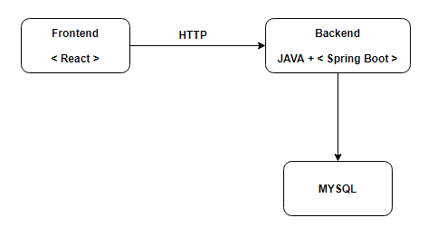
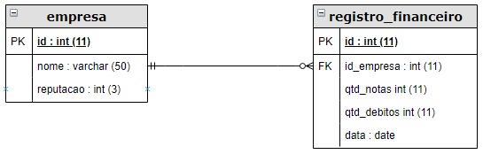
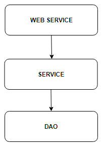

# Solução do Teste Serasa

## Arquitetura da Solução
Para resolver o desafio do teste serasa, foi utilizado a seguinte arquitetura:

* Para interface do frontend foi utilizado o framework React, e as linguagens JavaScrit, HTML e CSS;
* Para API do backend foi utilizado a linguagem JAVA e a IDE Eclipse, com o framework Spring Boot;
* Para o banco de dados, foi utilizado o MySql;
* Para conexão do frontend com o backend, foi utilizado Web Service via HTTP.

## Prepação do Projeto

* Criação do banco de dados no MySql;
* Criação do projeto Spring Boot utilizando a ferramenta Spring Initializr. Onde foram adicionadas as dependências Lombok, Spring Web e Spring Data JPA;
* Criação do repositório no Github;
* Foi adicionado o conector MySql no arquivo pom.xml;
* Foi adicionado as configurações para conexão com o banco de dados MySql no arquivo application.properties

## Modelo Entidade Relacionamento

## Implementação do backend

A solução do backend foi desenvolvida em camadas como é possível observar no diagrama abaixo:

* Na camada de Web Service, são expostas todas as rotas;
* Na camada de Service, se encontram todas as regras de negócio;
* Na camada de DAO, ficam todas as regras de acessos ao banco de dados.

## Testes Unitários

Foram feitos três testes unitários na aplicação:
* Confiabilidade da empresa limitada a 100% (máximo);
* Confiabilidade da empresa limitada a 1% (mínimo);
* Confiabilidade da empresa com pontuação final de 51%, computando como entrada três notas fiscais e um débito.

Para efetuar os testes da API foi utilizado o Postman.

## Implementação do Frontend

Para criar a interface de usuário no frontend, foi utilizada a biblioteca React para Javascript.